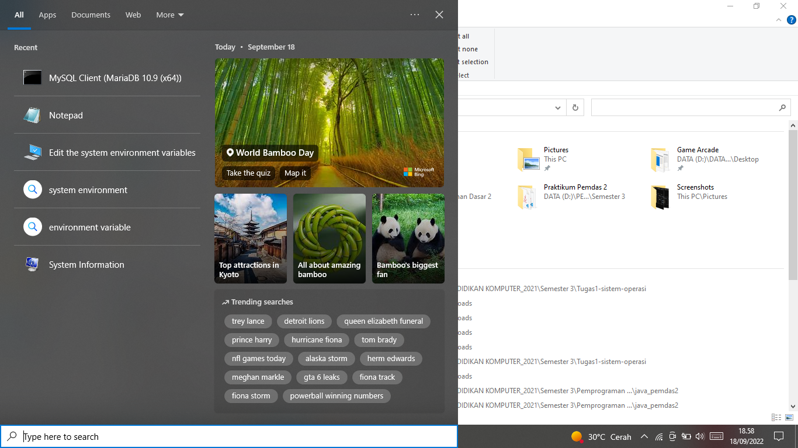
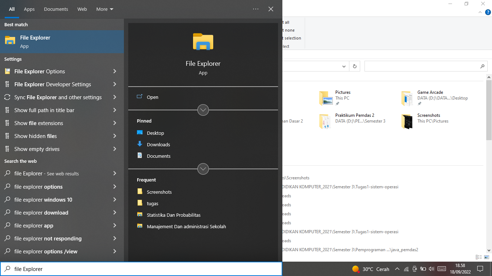
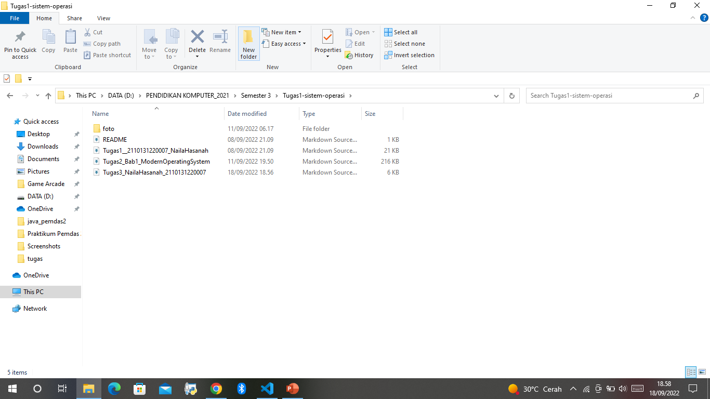
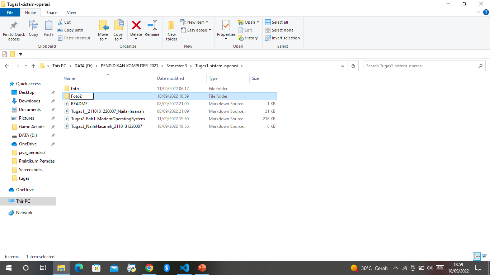
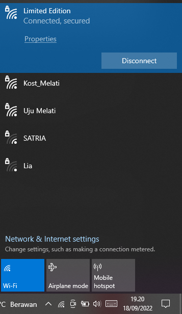

# Nama : Naila Hasanah
# NIM  : 210131220007

 

 # Tugas 3 Sistem Operasi

 
 

# 1.Komponen Sistem Operasi

Sebuah sistem operasi dapat dibagi menjadi beberapa komponen. Secara umum, para pakar sepakat bahwa terdapat sekurangnya empat komponen manajeman utama yaitu: 
- Manajemen Proses, 
- Manajemen Memori, dan 
- Manajamen Sistem Berkas. 
- Manajemen Masukan/Keluaran

Selain keempat komponen di atas, Avi Silberschatz, dan kawan-kawan menambahkan beberapa komponen seperti: 
- Manajemen Penyimpanan Sekunder. 
- Manajemen Sistem Proteksi. 
- Manajemen Jaringan. 
- Command-Interpreter System. 

*Berikut Contoh Komponen yang ada pada laptop saya :*
## Manajemen Berkas

    

Berkas merupakan sekumpulan informasi-informasi yang berhubungan sesuai pada tujuan pembuat berkas tersebut. Berkas juga bisa mempunyai suatu struktur yang memiliki sifat hirarkis.

Dan juga sistem operasi dapat bertanggung jawab pada hal di bawah ini :

- Pembuatan dan juga penghapusan suatu direktori.
- Dapat memerakan berkas ke dalam secondary storage.
- Pembuatan dan juga penghapusan suatu berkas.
- Dapat membackup berkas ke dalam media penyimpanan yang non volatile.
- Dapat mendukung manipulasi suatu direktori dan juga berkas.

 
 

## Contoh dari manejemen berkas adalah membuat folder baru.

    

- Buka file explorer

    

- Untuk membuat folder baru pilih new folder pada bagian atas 

    

- Ketikkan Nama folder sesuai format yang di inginkan

    

- Folder baru dengan nama yang sudah dibuat 

 
 

## Jaringan

    

Suatu sistem yang terdistribusi merupakan kumpulan dari processor-processor yang tak dapat berbagi dengan clock maupun memori. Setiap processor memiliki memorinya sendiri.

Processor tersebut juga telah tersambung melalui jaringan komunikasi. Sistem yang terdistribusi dapat menyediakan akses dari pengguna kepada bermacam-macam sumper daya sistemnya. Akses tersebut juga bisa menyebabkan :

- Mempercepat komputasi.
- Peningkatan ketersediaan data.
- Peningkatan kemampuan.

 

**Contoh  Jaringan pada laptop saya**

    

## Command-Interpreter-System

Suatu sistem operasi akan menunggu instruksi dari command driven atau pengguna. Programnya akan membaca sejumlah instruksi dan juga akan mengartikan control statements yang biasanya juga disebut sebagai control-card interpreter, command-line interpreter, dan UNIX shell.

Command Interpreter System ini juga memiliki banyak sekali variasi dari suatu sistem operasi ke sistem operasi yang lainnya dan dapa disesuaikan dengan teknologi input dan output device yang tersedia juga tujuannya. Contohnya yaitu seperti Pen-based (touch, CLI, Windows, dan lain sebagainya.

## - Contoh CLI 

    

 

# 2.Layanan Sistem Operasi

Layanan sistem operasi dirancang untuk membuat pemrograman menjadi lebih mudah. 

1. Pembuatan Program: Sistem operasi menyediakan berbagai fasilitas yang membantu programer dalam membuat program seperti editor. Walaupun bukan bagian dari sistem operasi, tapi layanan ini diakses melalui sistem operasi. 

2. Eksekusi Program: Sistem harus bisa me-load program ke memori, dan menjalankan program tersebut. Program harus bisa menghentikan pengeksekusiannya baik secara normal maupun tidak (ada error). 

3. Operasi Masukan/Keluaran. Program yang sedang dijalankan kadang kala membutuhkan Masukan/Keluaran. Untuk efisiensi dan keamanan, pengguna biasanya tidak bisa mengatur peranti Masukan/Keluaran secara langsung, untuk itulah sistem operasi harus menyediakan mekanisme dalam melakukan operasi Masukan/Keluaran.

 

4. Manipulasi Sistem Berkas. Program harus membaca dan menulis berkas, dan kadang kala juga harus membuat dan menghapus berkas. 

5. Komunikasi. Kadang kala sebuah proses memerlukan informasi dari proses yang lain. Ada dua cara umum dimana komunikasi dapat dilakukan. Komunikasi dapat terjadi antara proses dalam satu komputer, atau antara proses yang berada dalam komputer yang berbeda, tetapi dihubungkan oleh jaringan komputer. Komunikasi dapat dilakukan dengan share-memory atau message-passing, dimana sejumlah informasi dipindahkan antara proses oleh sistem operasi. 

6. Deteksi Error. Sistem operasi harus selalu waspada terhadap kemungkinan error. Error dapat terjadi di CPU dan memori perangkat keras, Masukan/Keluaran, dan di dalam program yang dijalankan pengguna. Untuk setiap jenis error sistem operasi harus bisa mengambil langkah yang tepat untuk mempertahankan jalannya proses komputasi. Misalnya dengan menghentikan jalannya program, mencoba kembali melakukan operasi yang dijalankan, atau melaporkan kesalahan yang terjadi agar pengguna dapat mengambil langkah selanjutnya. 

### Layanan Sistem Operasi: Mempertahankan efisiensi sistem 

- Alokasi Sumber Daya. Ketika beberapa pengguna menggunakan sistem atau beberapa program dijalankan secara bersamaan, sumber daya harus dialokasikan bagi masing-masing pengguna dan program tersebut. 

- Accounting. Kita menginginkan agar jumlah pengguna yang menggunakan sumber daya, dan jenis sumber daya yang digunakan selalu terjaga. Untuk itu maka diperlukan suatu perhitungan dan statistik. Perhitungan ini diperlukan bagi seseorang yang ingin merubah konfigurasi sistem untuk meningkatkan pelayanan. 

- Proteksi. Layanan proteksi memastikan bahwa segala akses ke sumber daya terkontrol. Dan tentu saja keamanan terhadap gangguan dari luar sistem tersebut. Keamanan bisa saja dilakukan dengan terlebih dahulu mengidentifikasi pengguna. Ini bisa dilakukan dengan meminta password bila ingin menggunakan sumber daya. 

# 3. Sistem Call

    

Biasanya tersedia sebagai instruksi bahasa assembly. Beberapa sistem mengizinkan system calls dibuat langsung dari program bahasa tingkat tinggi. Beberapa bahasa pemrograman (contoh: C, C++) telah didefenisikan untuk menggantikan bahasa assembly untuk sistem pemrograman. 

Tiga metode umum yang digunakan dalam memberikan parameter kepada sistem operasi: 
Melalui register. 
Menyimpan parameter dalam block atau tabel pada memori dan alamat block tersebut diberikan  sebagai parameter dalam register. 
Menyimpan parameter (push) ke dalam stack oleh program, dan melakukan pop off pada stack  oleh sistem operasi. 

System calls yang berhubungan dengan kontrol proses antara lain ketika penghentian pengeksekusian program. Baik secara normal (end) maupun tidak normal (abort). 
Selama proses dieksekusi kadang kala diperlukan untuk me-load atau mengeksekusi program lain, disini diperlukan lagi suatu system calls. Juga ketika membuat suatu proses baru dan menghentikan sebuah proses. Ada juga system calls yang dipanggil ketika kita ingin meminta dan merubah atribut dari suatu proses. 
MS-DOS adalah contoh dari sistem single-tasking. MS-DOS menggunakan metoda yang sederhana dalam menjalankan program aan tidak menciptakan proses baru. Program di-load ke dalam memori, kemudian program dijalankan. Berkeley Unix adalah contoh dari sistem multi-tasking. Command Interpereter masih tetap bisa dijalankan ketika program lain dieksekusi. 

