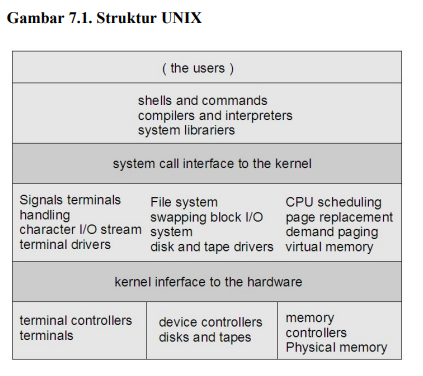
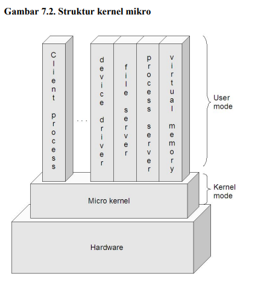

# Nama : Naila Hasanah
# NIM  : 2110131220007

# Tugas 4 Sistem Operasi

Sistem operasi modern adalah suatu sistem yang besar dan kompleks. Dan tentu saja proses mendesain
sistem operasi bukanlah pekerjaan mudah. Karena itu, didalam desain sistem operasi digunakan
suatu struktur agar sistem tersebut bisa dipelajari dengan mudah. digunakan, dan dikembangkan
lebih lanjut. 

Berikut beberapa struktur yang ada pada sistem  sistem operasi : 

# Struktur Sederhana

Pada awalnya, sistem operasi dimulai sebagai sistem yang kecil, sederhana, dan terbatas. Lama
kelamaan, sistem operasi semakin berkembang menjadi suatu sistem yang lebih besar dari awalnya.
Dalam perkembangannya, ada sistem yang terstruktur dengan kurang baik, dan ada juga yang baik.
Contoh sistem yang terstruktur kurang baik adalah MS-DOS. Sistem operasi ini dirancang sedemikian
rupa agar mampu berjalan pada hardware yang terbatas. Memang memiliki struktur, tapi belum
terbagi-bagi dalam modul-modul, dan interface serta fungsionalitas tidak begitu jelas batasannya.
Begitu pula dengan UNIX, yang pada awalnya juga terbatas oleh hardware yang ada. Sistem ini dapat
dibagi menjadi dua bagian, yaitu kernel dan program sistem. Kernel sendiri dapat dibagi menjadi
dua bagian, yaitu device driver dan interface, yang kemudian terus berkembang seiring dengan
perkembangan UNIX. Berikut ini adalah skema struktur UNIX.

    

Kelebihan Struktur Sederhana:

Layanan dapat dilakukan sangat cepat karena terdapat di satu ruang alamat.
Kekurangan Struktur Sederhana:

- Pengujian dan penghilangan kesalahan sulit karena tidak dapat dipisahkan dan dilokalisasi.
- Sulit dalam menyediakan fasilitas pengamanan.
- Merupakan pemborosan bila setiap komputer harus menjalankan kernel monolitik sangat besar sementara sebenarnya tidak memerlukan seluruh layanan yang disediakan kernel.
- Tidak fleksibel.
- Kesalahan pemograman satu bagian dari kernel menyebabkan matinya seluruh sistem.

# Struktur Berlapis

Rasanya susah membayangkan sekian banyak fungsi yang disediakan oleh sistem operasi
diimplementasikan dalam satu program saja. Karena itu, lebih mudah untuk membaginya dalam
sejumlah layer/lapisan. Tentu setiap lapisan memiliki fungsinya sendiri-sendiri, dan juga bisa
menambah fungsi-fungsi lain, berdasarkan fungsi-fungsi yang tersedia pada lapisan-lapisan lain yang
dibawahnya.
Lapisan-lapisan sistem operasi adalah suatu abstraksi dari enkapsulasi sekumpulan struktur data dalam
sistem operasi. Lapisan-lapisan yang berada di atas bisa mengakses operasi-operasi yang tersedia di
lapisan-lapisan bawahnya. Stallings memberi model yang lebih detail, sebagai berikut:

• Lapisan 1. Berisi berbagai sirkuit elektronik, misal register, memory cells, dan logic gate.

• Lapisan 2. Berisi instruksi prosesor, misal instruksi aritmatika, instruksi transfer data, dsb.

• Lapisan 3. Penambahan konsep seperti prosedur/subrutin, maupun fungsi yang me-return nilai
tertentu.

• Lapisan 4. Penambahan interrupt.

• Lapisan 5. Program sebagai sekumpulan instruksi yang dijalankan oleh prosesor.

• Lapisan 6. Berhubungan dengan secondary storage device, yaitu membaca/menulis head, track,
dan sektor.

• Lapisan 7. Menciptakan alamat logika untuk proses. Mengatur hubungan antara main memory,virtual memory, dan secondary memory.

• Lapisan 8. Program sebagai sekumpulan instruksi yang dijalankan oleh prosesor.

• Lapisan 9. Berhubungan dengan secondary storage device, yaitu membaca/menulis head,track,
dan sektor.

• Lapisan 10. Menciptakan alamat logika untuk proses. Mengatur hubungan antara main memory,virtual memory, dan secondary memory.
• Lapisan 11. Program sebagai sekumpulan instruksi yang dijalankan oleh prosesor.

• Lapisan 12. File adalah objek yang memiliki nama dan ukuran. Abstraksi dari lapisan 9.

• Lapisan 13. Menyediakan interface agar bisa berinteraksi dengan pengguna.

Lapisan-lapisan dari 1-4 bukanlah bagian dari sistem operasi dan masih menjadi bagian dari prosesor
secara ekslusif.

Lapisan ke-5 hingga ke-7, sistem operasi sudah berhubungan dengan prosesor. Selanjutnya dari lapisan
ke-8 hingga 13, sistem operasi berhubungan dengan media penyimpanan maupun perlatan-peralatan
lain yang ditancapkan, misalnya peralatan jaringan.

## Dari ketiga sumber diatas dapat kita simpulkan bahwa lapisan sistem operasi secara umum terdiri atas 4 bagian, yaitu:

- Perangkat keras
Lebih berhubungan kepada perancang sistem. Lapisan ini mencakup lapisan 0 dan 1 menurut Tanenbaum, dan level 1 sampai dengan level 4 menurut Stallings.

- Sistem operasi
Lebih berhubungan kepada programer. Lapisan ini mencakup lapisan 2 menurut Tanenbaum, dan level 5 sampai dengan level 7 menurut Stallings.

- Kelengkapan
Lebih berhubungan kepada programer. Lapisan ini mencakup lapisan 3 menurut Tanenbaum, dan level 8 sampai dengan level 11 menurut Stallings.

- Program aplikasi
Lebih berhubungan kepada pengguna aplikasi komputer. Lapisan ini mencakup lapisan 4 dan lapisan 5 menurut Tanebaum, dan level 12 dan level 13 menurut Stallings.

Lapisan n memberi layanan untuk lapisan n+1. Proses-proses di lapisan n dapat meminta layanan lapisan n-1 untuk membangunan layanan bagi lapisan n+1. Lapisan n dapat meminta layanan lapisan n-1. Kebalikan tidak dapat, lapisan n tidak dapat meminta layanan n+1. Masing-masing berjalan di ruang alamat-nya sendiri. Kelanjutan sistem berlapis adalah sistem berstruktur cincin seperti sistem MULTICS. Sistem MULTICS terdiri 64 lapisan cincin dimana satu lapisan berkewenangan berbeda. Lapisan n-1 mempunyai kewenangan lebih dibanding lapisan n. Untuk meminta layanan lapisan n-1, lapisan n melakukan trap. Kemudian, lapisan n-1 mengambil kendali sepenuhnya untuk melayani lapisan n.

**Kelebihan Sistem Berlapis (layered system):**

Memiliki rancangan modular, yaitu sistem dibagi menjadi beberapa modul & tiap modul dirancang secara independen.
Pendekatan berlapis menyederhanakan rancangan, spesifikasi dan implementasi sistem operasi.

**Kekurangan Sistem Berlapis (layered system):**

Fungsi-fungsi sistem operasi diberikan ke tiap lapisan secara hati-hati.

Contoh: Sistem operasi yang menggunakan pendekatan berlapis adalah THE yang dibuat oleh Djikstra dan mahasiswa-mahasiswanya, serta sistem operasi MULTICS.

# Struktur Mikro

Kernel adalah komponen sentral dari sistem operasi. Ia mengatur hal-hal seperti interrupt
handler(untuk menyediakan layanan interupsi), process scheduler(membagi-bagi proses dalam
prosesor), memory management, I/O, dan sebagainya. Atau dengan kata lain, ia adalah jembatan antara
hardware dengan software.

Metode struktur ini adalah menghilangkan komponen-komponen yang tidak diperlukan dari kernel dan mengimplementasikannya sebagai sistem dan program-program level user. Hal ini akan menghasilkan kernel yang kecil. Fungsi utama dari jenis ini adalah menyediakan fasilitas komunikasi antara program client dan bermacam pelayanan yang berjalan pada ruang user.

Cara tradisional untuk membangun sistem operasi adalah dengan membuat kernel monolitis, yaitu
semua fungsi disediakan oleh kernel, dan ini menjadikan kernel suatu program yang besar dan
kompleks.

Cara yang lebih modern, adalah dengan menggunakan kernel mikro. Pada awalnya, konsep mikro
kernel dikembangkan pada sistem operasi Mach. Ide dasar dari pengembangan kernel mikro adalah
bahwa hanya fitur-fitur yang perlu saja yang diimplementasikan dalam kernel (mengenai fitur-fitur
apa saja yang perlu diimplementasikan, ini bisa berbeda tergantung desain sistem operasi).

Walaupun garis pembatas mengenai apa saja yang berada di dalam dan luar kernel mikro bisa berbeda
antara desain yang satu dengan yang lain, namun ada karakteristik yang umum, yaitu servis-servis yang
umumnya menjadi bagian sistem operasi menjadi subsistem eksternal yang bisa berinteraksi satu sama
lain dan dengan kernel tentunya. Ini mencakup device driver, file system, virtual memory manager,
windowing system, dan security devices. Pendekatan kernel mikro menggantikan pendekatan berlapis
yang vertikal tradisional.

Komponen-komponen sistem operasi yang berada di luar kernel mikro diimplementasikan sebagai
server process dan berkomunikasi dengan message passing via kernel mikro. Misalnya jika user ingin
membuat berkas baru, dia mengirim pesan ke file system server, atau jika ingin membuat proses baru,
dia mengirimkan pesan ke process server.

 

    

**kelebihan kernel mikro:**

a. Interface yang seragam. Proses tidak lagi dibedakan, baik antara kernel-level maupun userlevel, karena semuanya berkomunikasi via message passing.

b. Extensibility . Bisa menambahkan fitur-fitur baru tanpa perlu melakukan kompilasi ulang.

c. Flexibility . Fitur-fitur yang sudah ada bisa dikurangi, atau dimodifikasi sesuai dengan
kebutuhan sehingga menjadi lebih efisien. Misalnya tidak semua pengguna membutuhkan security
yang sangat ketat, atau kemampuan untuk melakukan distributed computing.

d. Portability . Pada kernel mikro, semua atau sebagian besar kode yang prosesor-spesifik berada
di dalamnya. Jadi, proses porting ke prosesor lain bisa dilakukan dengan relatif sedikit usaha. Pada
kelompok desktop misalnya, tampaknya dominasi Intel makin kuat. Tapi, sampai seberapa lama
itu bisa bertahan? Karena itulah, portability adalah salah satu isu yang sangat penting.

e. Reliability . Semakin besar suatu software, maka tentulah semakin sulit untuk menjamin
reliability-nya. Desain dengan pendekatan berlapis sangatlah membantu, dan dengan pendekatan
kernel mikro bisa lebih lagi. Kernel mikro dapat dites secara ekstensif .Karena dia menggunakan
API yang sedikit, maka bisa meningkatkan kualitas code di luar kernel.

f. Support for object-oriendted OS . Model kernel mikro sangat sesuai untuk mengembangkan
sistem operasi yang berbasis object-oriented. Contoh sistem operasi yang menggunakan kernel
mikro adalah MacOS X dan QNX.

**Kekurangan Kernel Mikro:**

kinerja akan berkurang selagi bertambahnya fungsi-fungsi yang digunakan.
Contoh: sistem operasi yang menggunakan metode ini adalah TRU64 UNIX, MacOSX dan QNX
